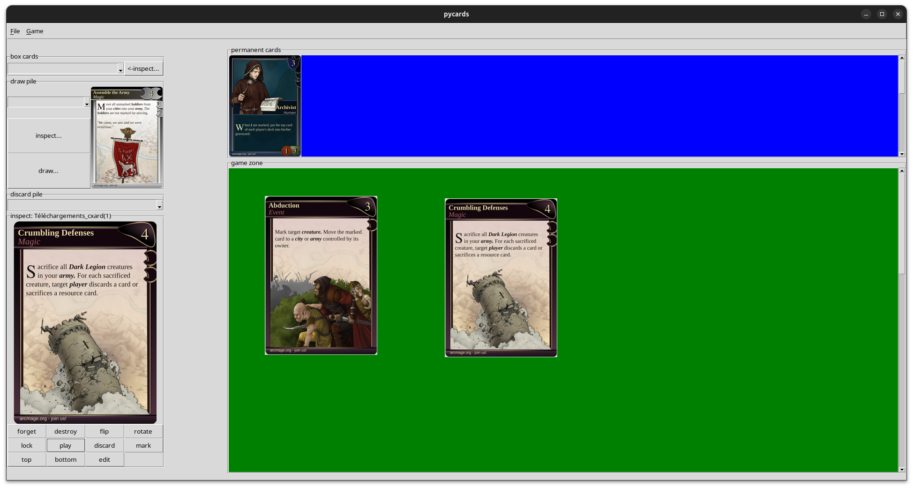

pycards
===================

GUI to play your favorite card game. The rules are not coded, but it allows to manipulate a deck of card, shuffle them, discover, destroy or lock single cards. You can import any set of cards (not included here).
The idea is to reset a legacy card game, instead of buying a new one and you still keep the legacy part. Here is how it could look (with sample cards from arcmage as an example):

Requirements
===============

* python 3.7
* it was developped on ubuntu linux and the installation procedure is described with this system. However, it should also probably work on windows

Installation
============

preferably in a virtual environement, simply do:

.. code-block:: bash

    pip install git+https://github.com/ImamAzim/pycards.git

and to run the game:

.. code-block:: bash

    pycards

How to play
=============

* start a new game (or load a previous one) with the file menu on top
* at the beginning, there are no cards, you need to import some with the file menu (as if you were buying them). There are no cards included, so you need to create them or download from other sources.
* when the cards are imported, they are in the "box" and you can inspect them but are not yet part of your deck. You need to "discover" them, so that they will be part of your your deck
* cards from your deck will be either in the draw pile, discard pile, game zone or permanent zone.
* with the inspector, your can manipulate your cards (change pile, rotate, flip, edit, etc...)
* when cards are in the game or permanent zone, they can be moved with drag and drop.
* the first card on the draw pile is immediately visible, not the rest. (but you can inspect them if you want).
* with the Game menu, you can put all the cards from the discard pile in the draw pile and shuffle them.

Documentation of all options in the GUI
=======================================

File Menu
-----------

all general options to modify your game:

* **new game**: enter your name and new game will be created
* **load game**: select from the list a previous game to load (note: there is no save options, because every changes are always saved. you cannot undo permanent change, as in a legay game)
* **delete active game**: delete the current game from disk
* **import cards**: select a folder that contains all your cards to be imported. it needs to be image files. filename will be used to name cards. There is always a recto and a verso, so you need 2 image file for each card. alphabetic order is used to guess the verso, so you can name it *card_1.png* and *card_1_verso.png* for example.
* **import stickers**: select a folder containing stickers that can be sticked on cards later. it must be image files. you need multiple copy of the same image if you are going to stick it several times
* **quit**: quit the GUI.

Game Menu
----------

options to manipulate all cards at once:

* **discard all**: put all the cards from the game zone in the discard pile
* **shuffle**: put all the cards from the discard pile in the draw pile and shuffle the order.

Box cards
----------

Draw pile
----------

Discard Pile
-------------

inspector
----------

game zone
----------

permanent card zone
--------------------

License
=======

The project is licensed under GNU GENERAL PUBLIC LICENSE v3.0
